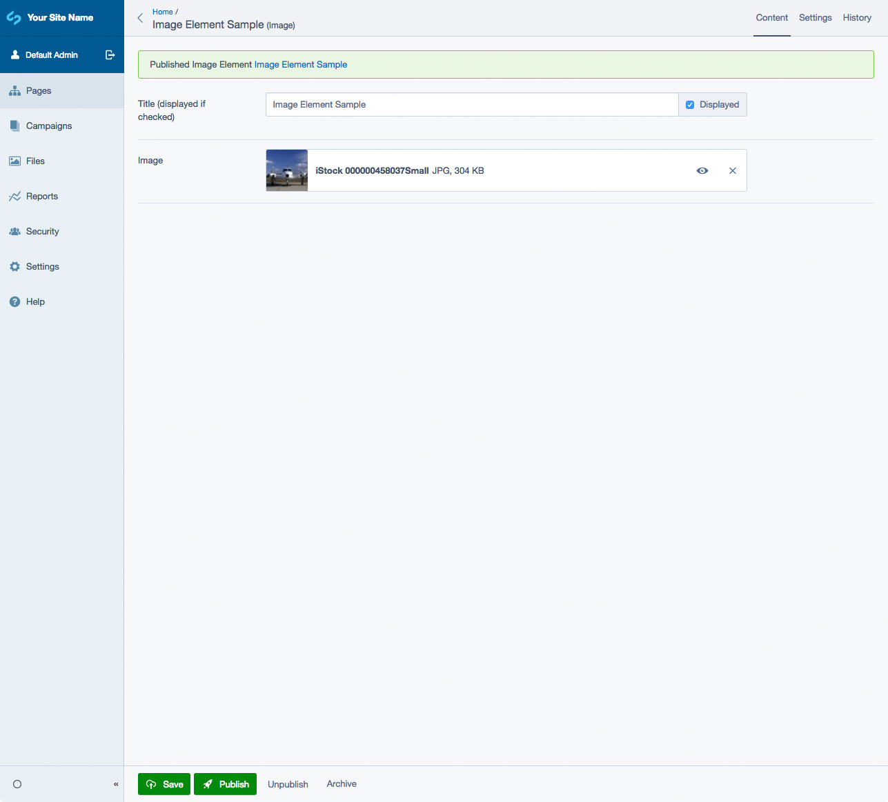

# Silverstripe Elemental Image

A block to add a single image to your page.

## Requirements

* dnadesign/silverstripe-elemental: ^5
* jonom/focuspoint: ^5

## Installation

`composer require dynamic/silverstripe-elemental-image`

## License

See [License](LICENSE.md)

## Example usage

Adds a block to display a single image on a page. Useful to break up long sections of text.

## Screen Shots

#### Front End sample of an Image Element

#### CMS - Image Element Main Tab

## Getting more elements

See [Elemental modules by Dynamic](https://github.com/orgs/dynamic/repositories?q=elemental&type=all&language=&sort=)

## Configuration

See [SilverStripe Elemental Configuration](https://github.com/silverstripe/silverstripe-elemental#configuration)

## Maintainers

 *  [Dynamic](https://www.dynamicagency.com) (<dev@dynamicagency.com>)

## Bugtracker
Bugs are tracked in the issues section of this repository. Before submitting an issue please read over
existing issues to ensure yours is unique.

If the issue does look like a new bug:

 - Create a new issue
 - Describe the steps required to reproduce your issue, and the expected outcome. Unit tests, screenshots
 and screencasts can help here.
 - Describe your environment as detailed as possible: SilverStripe version, Browser, PHP version,
 Operating System, any installed SilverStripe modules.

Please report security issues to the module maintainers directly. Please don't file security issues in the bugtracker.

## Development and contribution
If you would like to make contributions to the module please ensure you raise a pull request and discuss with the module maintainers.
